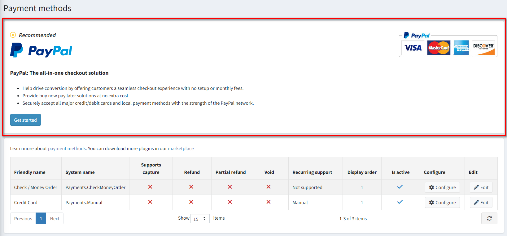
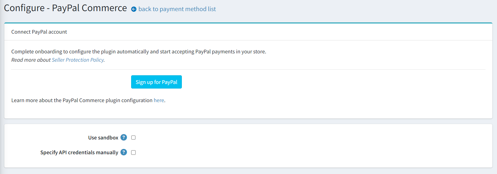
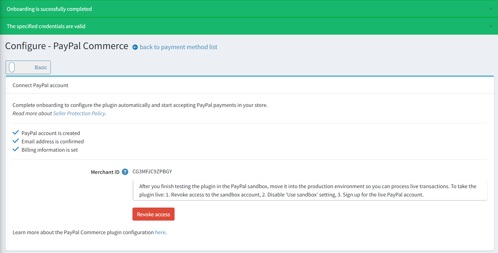
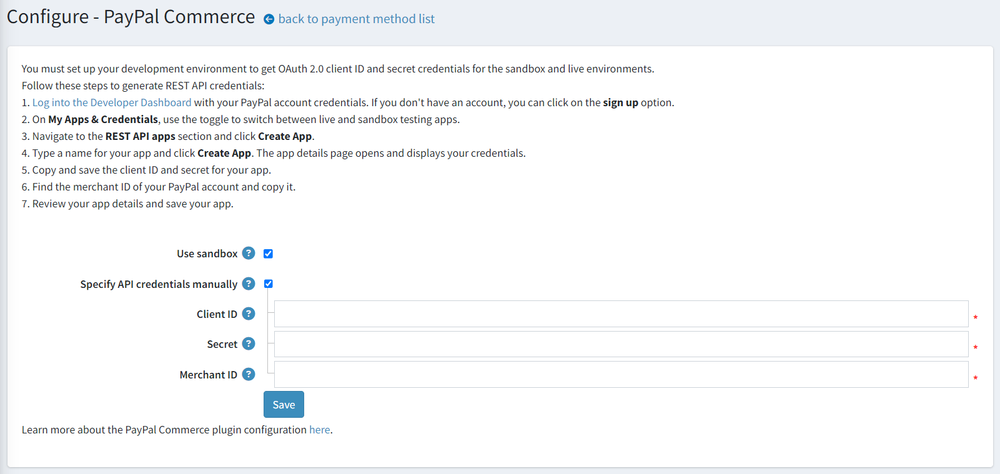
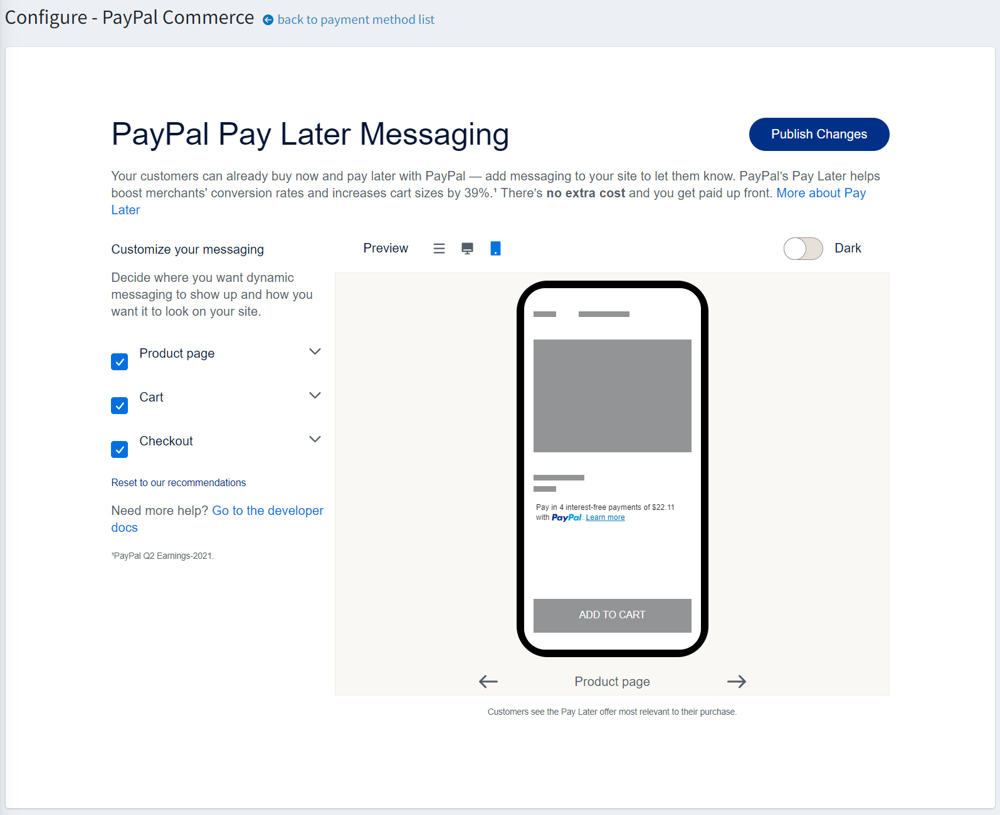
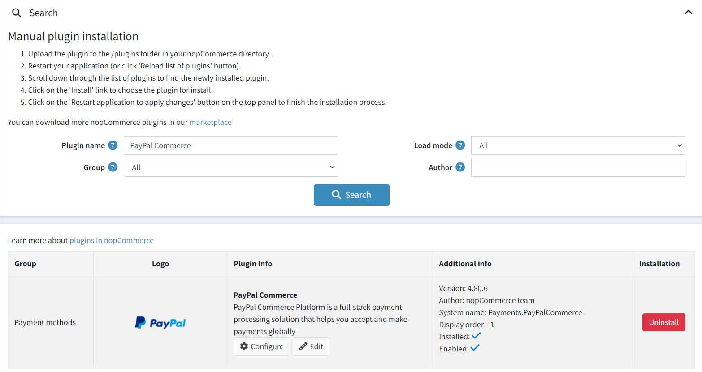
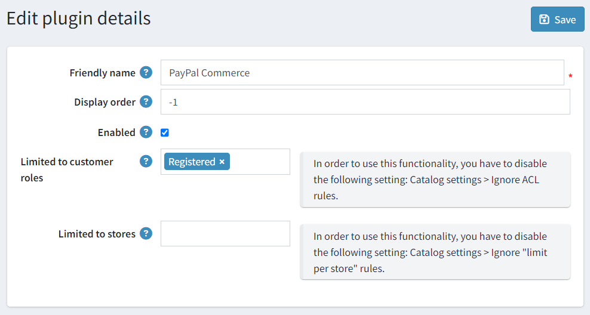

---
title: PayPal Commerce
uid: en/getting-started/configure-payments/payment-methods/paypal-commerce
author: git.RomanovM
contributors: git.DmitriyKulagin
---

# PayPal Commerce

`PayPal Commerce` gives your buyers a simplified and secure checkout experience. PayPal intelligently presents the most relevant payment types to your shoppers automatically, making it easier for them to complete their purchases using such methods as Credit Card payments, Apple Pay, Google Pay, PayPal Credit, Venmo, iDEAL, Bancontact, and other payment types.

## Configure the payment method

To configure the `PayPal Commerce` plugin, go to **Configuration → Payment methods**. Then find the **PayPal** payment method on this page. This will not be difficult to do as it's our recommended payment method.

Follow these steps to configure `PayPal Commerce`:

### 1. Connect PayPal account

It doesn't matter whether you already have a PayPal business account, or only a personal one, or none at all, the connecting starts the same way:

1. Open the PayPal Commerce configuration page in the admin area. You will see the following form:

    

1. Select the type of account you want to connect, production or sandbox. If you want to test the plugin first, enable **Use sandbox** setting.

1. Click **Sign up for PayPal** button and you will see the following pop-up window allowing you to fill in some data and connect an account:

    

    You will need to go through few steps to fill in all the required details, the number of details will vary depending on whether you are creating a new account, connecting an existing one, or converting a personal account to a business.

1. Once you are done and approved to use PayPal payments, go back to the plugin configuration page and refresh it. You will see the following form:

    

   Here you will see notifications about successful connection, if there are warnings or errors, refer to **System → Log** to find out more details.

   There will also be the status of the account connection process, if any of the steps is not completed, log into your PayPal personal account and complete this step.

   If you connected a sandbox account, there will also be a reminder about the need to create a production account after completing the testing.

1. In case you already have REST API App created in your PayPal account and want to continue using it, you should select **Specify API credentials manually** checkbox and specify the credentials in the fields below as follows:

    

### 2. Configure the plugin

1. Find the **PayPal Commerce** payment method on the **Configuration → Payment methods** page and click **Configure**, you'll see the following settings block:
    
    
    
    * Choose the **Payment type** to either capture payment immediately or authorize payment for an order after order creation.
    * Select the **Use Custom Card Fields** to enable Advanced Credit and Debit Card Payments in your store. This is a PCI compliant solution to accept debit and credit card payments directly on your store without the need for customers to redirect to third-party sites.
    * Select the **Use Apple Pay** to enable Apple Pay in your store. Before getting started in sandbox/production environment verify any domain names in your environment that will show an Apple Pay button. Apple Pay transactions only work on a domain and site registered to you.
    
        1. [Download](https://paypalobjects.com/devdoc/apple-pay/well-known/apple-developer-merchantid-domain-association) the domain association file for your environment. 
        1. Host the file on your site for each domain and subdomain you want to register, at */.well-known/apple-developer-merchantid-domain-association*.
        1. Log into the PayPal Merchant Account, go to **Payment Methods**, then select the **Manage** link in the **Apple Pay** section and **Add Domain** there.

    * Select the **Use Google Pay** to enable Google Pay in your store.
    * Select the **Use Alternative Payments Methods** to enable alternative payments methods in your store. With alternative payment methods, customers across the globe can pay with their bank accounts, wallets, and other local payment methods. For example, a customer in the Netherlands might want to pay using iDEAL, which is used by more than half of consumers in the Netherlands for online purchases, whereas a customer in Belgium on the same website might want to pay using Bancontact, a popular payment method there. The plugin automatically will render all eligible buttons in a single location by default.
    * Select the **Use Vault** to enable PayPal Vault. It allows to securely store customers payment information and use it in subsequent transactions without customers having to re-enter payment details.
    * Select the **Skip 'Confirm Order' page** to skip this step during checkout so that after approving the payment on PayPal site, customers will redirected directly to the 'Order Completed' page.
    * Select the **Use shipment tracking** to use the package tracking. To automatically sync the shipment status with PayPal, specify the tracking number and carrier when creating or editing the shipment in the admin area:
    
      

1. Then proceed to the *Feature PayPal Prominently* panel:
    
    
  
    On this panel, define the display settings:

      * Select the **Display buttons on shopping cart** checkbox to display PayPal buttons on the shopping cart page in addition to the default checkout button.

      * Select the **Display buttons on product details** checkbox to display PayPal buttons on product details pages allowing buyers to complete a purchase without going through the full checkout process.

      * Select the **Display logo in header links** checkbox to display a PayPal logo in the header links. These logos and banners are a great way to let your buyers know that you choose PayPal to securely process their payments.
        * If the previous checkbox is selected, the **Logo source code** field is displayed. In this field, enter the source code of the logo. Find more logos and banners on PayPal Logo Center. You can also modify the code to fit correctly into your theme and site style.

      * Select the **Display logo in footer** checkbox to display a PayPal logo in the footer. These logos and banners are a great way to let your buyers know that you choose PayPal to securely process their payments.
        * If the previous checkbox is selected, the **Logo source code** field is displayed. In this field, enter the source code of the logo. Find more logos and banners on PayPal Logo Center. You can also modify the code to fit correctly into your theme and site style.

1. Click **Save** to save the plugin settings.

> [!NOTE]
>
> You don't need to activate the plugin, it'll be enabled immediately after installation. If for some reason you don't intend to use it in your store, you can disable it on **Configuration → Local plugins** page.

### 3. Configure PayPal Pay Later Messaging

PayPal offers short-term, interest-free payments and other special financing options that buyers can use to buy now and pay later, while sellers get paid up-front. Pay Later offers vary depending on the country. With Pay Later offers, sellers can give shoppers increased buying power and flexibility to spread the cost of their purchases over time.
For more information about Pay Later, see [Buy now, pay later](https://www.paypal.com/digital-wallet/ways-to-pay/buy-now-pay-later).

1. Click the **Pay Later** link on the **Configuration → PayPal Commerce** menu item, you'll see the following configurator:

    

    Here you can customize your Pay Later messaging.

1. Click **Publish Shanges** to save the configuration.

## Limit to stores and customer roles

You can limit any payment method to store and customer role. This means that the method will be available to certain stores or customer roles only. You can do this from the *plugin list* page.

1. Go to **Configuration → Local plugins**. Find the plugin you want to limit. In our case, it's **PayPal Commerce**. To find it faster, use the *Search* panel in the top of the page and search by **Plugin name** or **Group** using the *Payment methods* option.

    

1. Click the **Edit** button, and the *Edit plugin details* window will be displayed as follows:

    

1. You can set up the following limits:

    * In the **Limited to customer roles** field, choose one or several customer roles, that is, administrators, vendors, guests, who will be able to use this plugin. If you don't need this option just leave this field empty.

        > [!Important]
        > In order to use this functionality, you have to disable the following setting: **Catalog settings → Ignore ACL rules (sitewide)**. Read more about the access control list [here](xref:en/running-your-store/customer-management/access-control-list).

    * Use the **Limited to stores** option to limit this plugin to a certain store. If you have multiple stores, choose one or several from the list. If you don't use this option, just leave this field empty.

        > [!Important]
        > In order to use this functionality, you have to disable the following setting: **Catalog settings → Ignore "limit per store" rules (sitewide)**. Read more about multi-store functionality [here](xref:en/getting-started/advanced-configuration/multi-store).
        
1. Click **Save**.    
