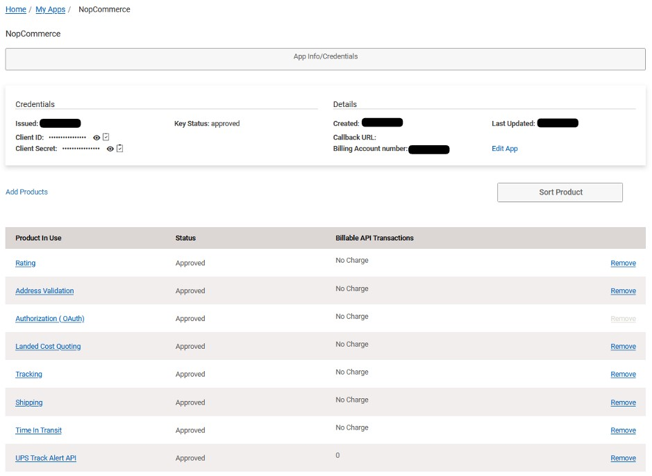
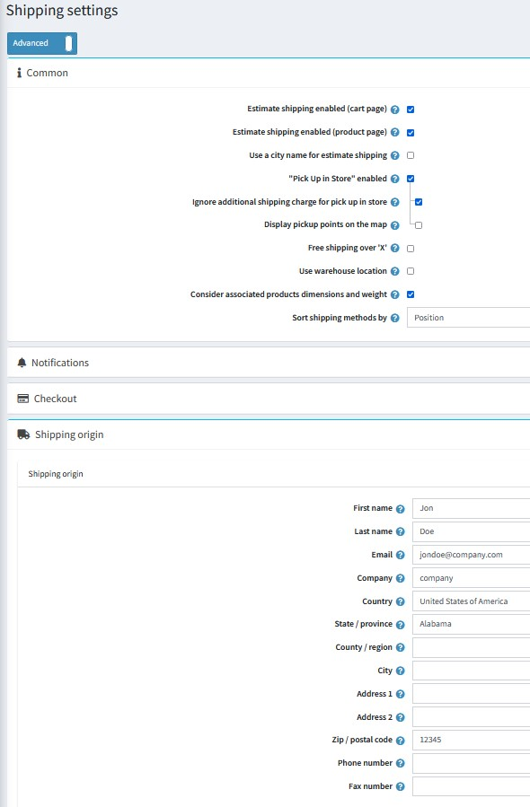
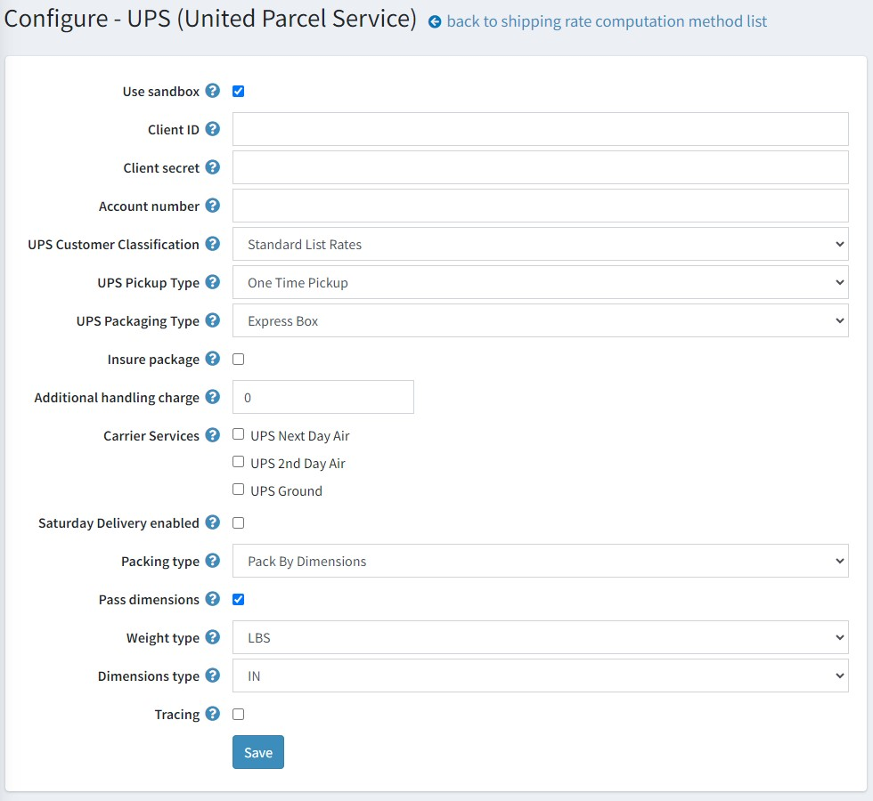

# UPS

## Define the UPS Real Time Shipping Calculations

1. Create a UPS user account via [UPS.com](https://www.ups.com/), then go to [developer.ups.com](https://developer.ups.com/), and create an app to receive the following:
   * Client ID
   * Client Secret
     > [!NOTE]
     > This is to use UPS OAuth, which is required for all new accounts after June 2023, and all accounts after June 2024

     

2. Add UPS Products to enable shipment tracking, rate calculations, etc. Recommended products are:

   * Rating
   * Address Validation
   * Landed Cost Quoting
   * Tracking
   * Shipping
   * Time In Transit

3. In the nopCommerce admin area, go to **Configuration → Settings → Shipping Settings**. Configure the shipping point location. The default option is to configure a single **Shipping Origin**, which is configured lower on the page. However you may also choose **Use Warehouse Location**, if you wish to use the settings configured in **Configuration → Shipping → Warehouse**. The **Use Warehouse Location** checkbox is revealed by choosing **Advanced** from the page configuration selector under the **Shipping settings** header.

   

4. In the nopCommerce admin area, go to **Configuration → Shipping → Shipping providers**.
   

5. Enable this method as follows:

   * In the UPS (United Postal Service) row, click the **Edit** button.
   * In the Is **active** column, select the check mark.
   * Click **Update**. The *false* option will becomes *true*.
6. Click **Configure** beside the UPS (United Parcel Service) option in the list.
   The *Configure – UPS (United Parcel Service)* window will be displayed as follows: 

   > [!WARNING]
   > Beginning in June of 2024, you will no longer be able to transact with UPS APIs using an access key for authentication and are required to update your security model to OAuth 2.0

7. Enter the following information obtained from the UPS provider, and choose the options that are relevant to your store:

   * Select the **Use sandbox** checkbox to use the testing environment.
   * Enter the **Client ID** of the UPS provider.
   * Enter the **Client Secret** obtained from the provider.
   * Enter your **Account Number** obtained from the provider.
   * Select your required **UPS Customer Classification** as follows:
     * Rates Associated With Shipper Number
     * Daily Rates
     * Retail Rates
     * Regional Rates
     * General List Rates
     * Standard List Rates
   * Select the required **UPS Pickup Type** as follows:
     * Daily Pickup
     * Customer Counter
     * One Time Pickup
     * On Call Air
     * Letter Center
     * Air Service Center
   * Select the required **UPS Packaging Type** as follows:
     * Unknown
     * Letter
     * Customer Supplied Package
     * Tube
     * P A K
     * Express Box
     * 10 kg Box
     * 25 kg Box
     * Pallet
     * Small Express Box
     * Medium Express Box
     * Large Express Box
   * Select the **Insure package** checkbox, to indicate the package will be insured.
   * Enter **Additional handling charge**. It is an additional fee to charge your customers.
   * Select the **Carrier Services** you want to offer to your customers.
   * Select to get rates for **Saturday Delivery enabled**.
   * Select the **Packing type**, as follows:
     * Pack by dimensions
     * Pack by one item per package
     * Pack by volume
   * Tick the **Pass dimensions** checkbox to pass package dimensions when requesting for rates.
   * Select the **Weight type** – pounds or kilograms.
   * Select the **Dimensions type** – inches or centimeters.
   * Tick the **Tracing** checkbox to record system tracing in the system log. The entire request and response XML will be logged (including AccessKey/Username, Password). Do not leave this enabled in a production environment.

   Click **Save**.
