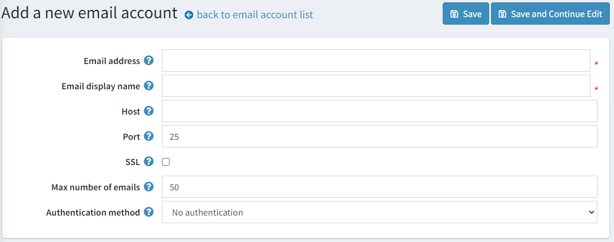
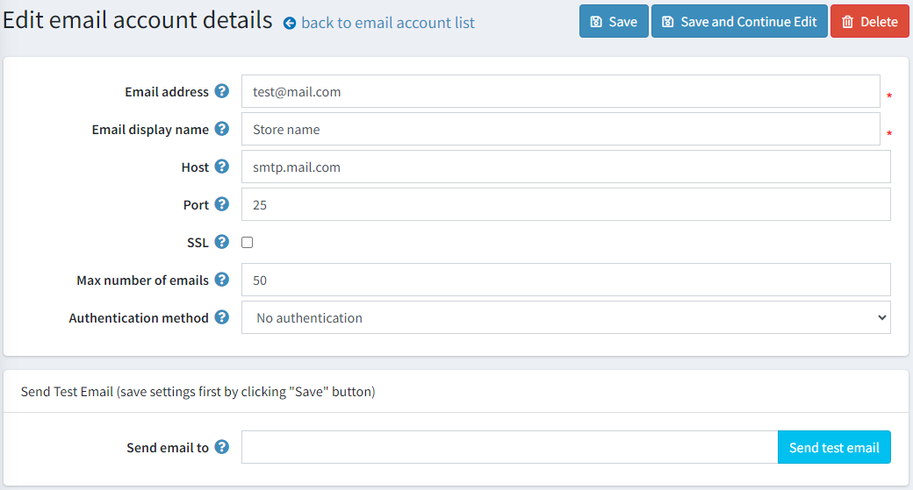

# Email accounts

This chapter describes how to set up email accounts associated with your store: a general contact email, a sales representative email, a customer support email, and more.

To manage email accounts, go to **Configuration → Email accounts**. The *Email accounts* window displays the email accounts of the store owner, as shown below. After the email accounts are configured, the store owner can select the required email account on the message template details page as described in the [Message templates](xref:en/running-your-store/content-management/message-templates) chapter.

## Add a new email account

To add a new email account, click **Add new**. The *Add a new email account* window will be displayed:

Define the following email account information:

* In the **Email address** field, enter the email address for all outgoing emails of your store. Example: `sales@yourstore.com`.
* In the **Email display name** field, enter the displayed name for outgoing emails of your store. Example: "Your store sales department."
* In the **Host** field, enter the host name of IP address of your email server.
* In the **Port** field, enter the SMTP port of your email server.
* Select the **SSL** checkbox to use Security Sockets Layer to encrypt the SMTP connection.
* In the **Max number of emails** field, enter the maximum number of emails sent at one time.
* Choose the **Authentication method** that will be used to identify the client when connecting to the SMTP server.
  * *No authentication* (no additional fields)
  * *NTLM (the default network credentials)*
  * *Login/Password*
    * In the **User** field, enter the user name of your email server.
    * In the **Password** field, enter the password of your email server.
  * *Google (OAuth2)*
  
    * The **Client ID**. Public identifier for application.
    * The **Client Secret**. The secret known only to the application and the authorization server.
  * *Microsoft (OAuth2)*
  
    * The **Tenant identifier** can be a GUID (the ID of your Microsoft Entra instance), domain name or one of placeholders: "organizations", "consumers", "common".
    * The **Client ID**. Public identifier for application.
    * The **Client Secret**. The secret known only to the application and the authorization server.

Click **Save**. The window will be expanded as follows:

In the **Send email to** field, enter the email address for the test email and click **Send test email**.
