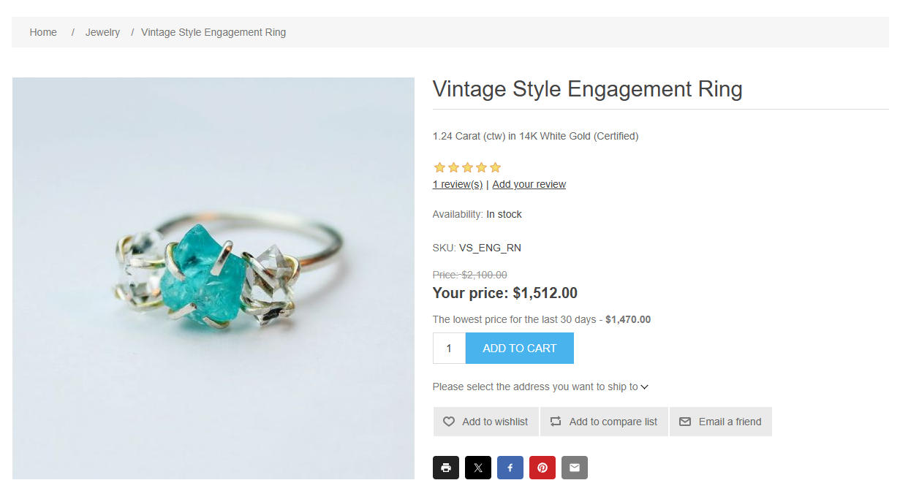
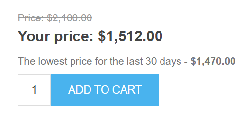
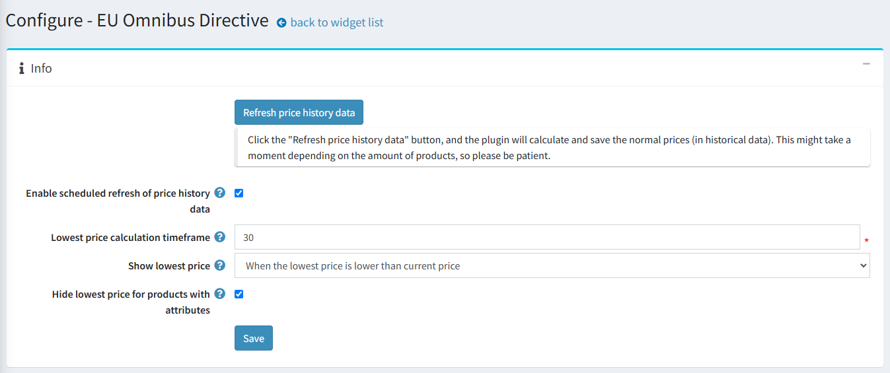
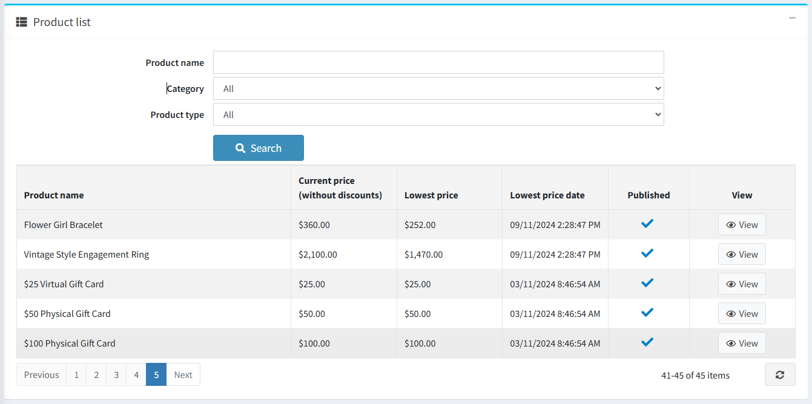
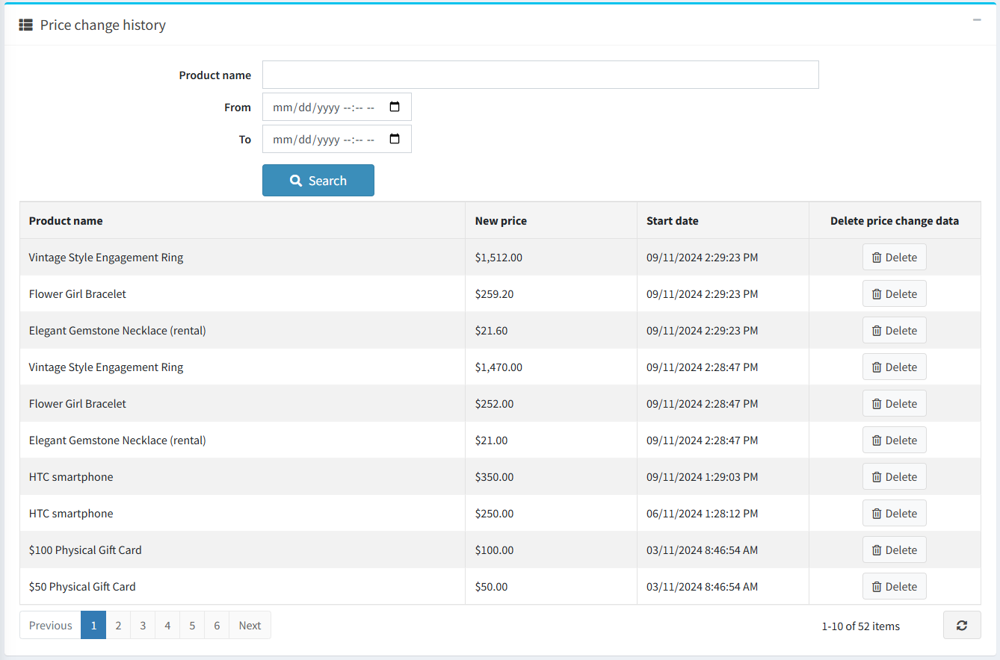
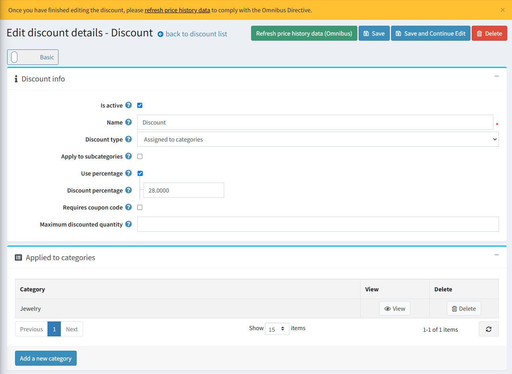

# EU Omnibus Directive

## Introduction

Please get Omnibus Directive integration [here](https://www.nopcommerce.com).

### What is Omnibus?

The Directive (EU) 2019/2161, also known as the [Omnibus Directive](https://eur-lex.europa.eu/eli/dir/2019/2161/oj), is a European Union directive aimed at strengthening consumer rights and promoting greater transparency by implementing sanctions to enforce these rights. The main objective of the Omnibus Directive is to enhance consumer protection rights across the entire European Union, and it applies to all e-commerce stores.

### Key Points of the Omnibus Directive:

* Any price reduction must be displayed on the e-commerce website by showing both the previous price and the current price after the discount.
* The lowest price recorded during the 30 days preceding the promotion must be used as the reference for applying the reduction.

### How to Apply Promotions in Full Compliance

Before planning a promotion or a discount period, you must ensure that all historical prices are available for at least 30 days prior to the promotion date. You should be able to prove and show your past prices from the last month if requested by your local authorities.

## nopCommerce plugin for the Omnibus Directive

To comply with the Omnibus Directive, our integration tracks price changes over a configured timeframe and displays the lowest price to customers. Tracking takes into account discounts applied to products, categories, or manufacturers.

The EU’s Omnibus Directive affects the way eCommerce businesses must display their product prices, particularly those on sale. The directive requires retailers to inform customers not only of the discounted price or percentage but also of the lowest price a product has been sold for in the past 30 days. These prices are known as omnibus prices. Businesses must be transparent in their pricing, making the omnibus prices stand out and be easily accessible to customers while maintaining consistency across all product pages.

### Plugin configuration

On the configuration page, you can enable history refresh, configure timeframe, set the customize the display options, and more.

Click the "Refresh price history data" button, and the plugin will calculate and save the normal prices (in historical data). This might take a moment depending on the amount of products, so please be patient. It’s recommended to do this after the plugin installation or when you start a new discount campaign.

> [!NOTE]
> The plugin only supports standard discounts. Discounts with personalized coupon codes are not supported.

The price history data is refreshed automatically every 24 hours for published products or instantly for a product when its price is changed (a product is created or edited).

1. If you want to disable scheduled refreshing of the price history data uncheck the **Enable scheduled refresh of price history data** checkbox, it’s enabled by default. This can be useful for stores with a large number of products.
1. To adjust the timeframe for calculating the lowest price enter the desired value into the **Lowest price calculation timeframe** field. By default, the integration displays the lowest price for the last 30 days prior to the current date.
1. Use the **Show lowest price** setting to select how to display the lowest price on the product details page:
    * **When the lowest price is lower than the current price** – to show the lowest price only when it's lower than the current one (otherwise, it'll be hidden).
    * **Always** – if you want to always display the lowest price (even if it's the same as the current one).
    * **Hide** – helpful when you've just installed the plugin and the collected data is not sufficient (it's recommended to choose this setting during the first 30 days of the plugin operation).

1. The **Hide lowest price for products with attributes** checkbox allows you to hide or show the lowest price for products with product attributes. Price history data is not saved for product attributes with price adjustments (we save standard product prices only).

The plugin automatically clears outdated price history data every 24 hours (history data that dates back earlier than the configured price calculation timeframe).

> [!NOTE]
> The schedule task does not delete a price history record that precedes the configured price calculation timeframe because it is taken as the initial price.

In the **Product list** block, you can see the current and the lowest prices, availability status, and the “View” button for editing the product. You can filter products by name, category, type, and store (if you have more than one).

The **Price change history** block contains all saved product prices. Each entry in the table has a button that allows you to delete it (for example, if the entry was saved by mistake). You can filter history change data by product name, calculation period, and store (if you have more than one).

On the discount details page, you can add all the discount info and list the products to which it is applied. We recommend manually refreshing the price change data by clicking the "Refresh price history data (Omnibus)" button once you’ve configured a discount promotion on the discount details page. Otherwise, this may lead to noncompliance with the Omnibus Directive between scheduled task runs (each 24 hours).

### Plugin installation

This section describes how to integrate the Dynamics 365 service into your store.

1. Purchase the integration [here](https://www.nopcommerce.com/).
1. Download the plugin archive.
1. Go to **Admin area > Configuration > Local plugins**.
1. Upload the plugin archive using the "Upload plugin or theme" button.
1. Scroll down the list of plugins to find the newly uploaded plugin.
1. Click on the **Install** button to install the plugin.

Please find more information about how to install plugins [here](https://docs.nopcommerce.com/getting-started/advanced-configuration/plugins-in-nopcommerce.html).
