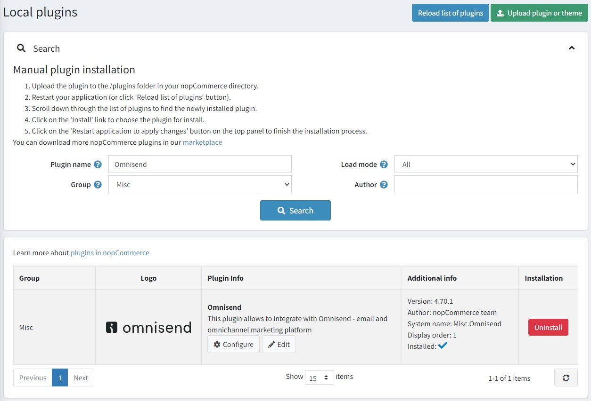
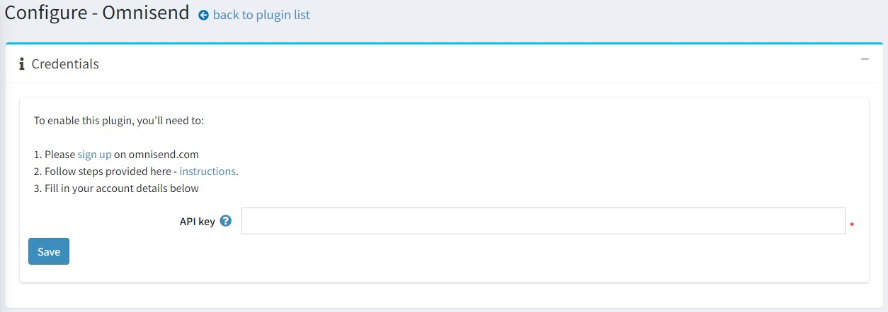
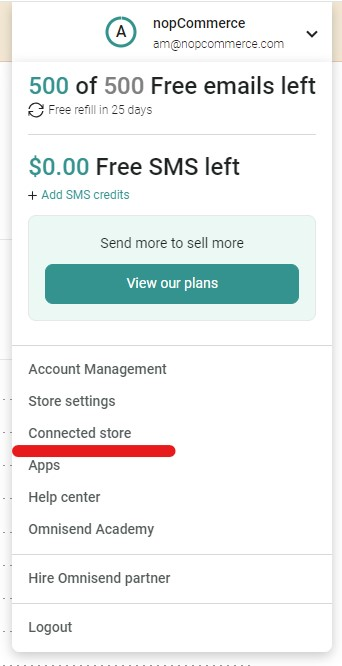
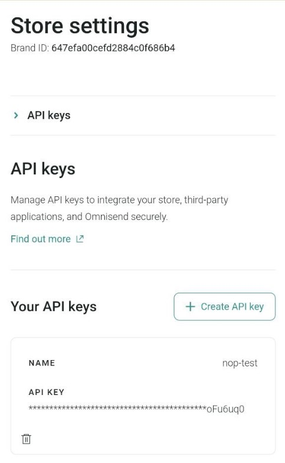
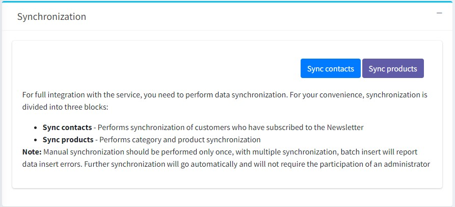

# Omnisend integration

This section describes how to integrate the Omnisend plugin into your store. The plugin supports all versions of nopCommerce, including minor versions from 4.30 to 4.70.

## What the Omnisend is

Omnisend is an email & SMS marketing automation platform that helps ecommerce stores to connect and engage with their customers. You can create popups and signup forms to collect new subscribers. Engage with them by taking advantage of channels like email and SMS. Use your store data to segment customers and drive sales with personalized automation.

## What the Omnisend plugin does

Omnisend plugin for nopCommerce allows the store owner:

* Synchronize contacts - performs synchronization of customers subscribed to the newsletter.
* Synchronize products - synchronizes categories and products.

## Install and enable the plugin

The Omnisend plugin is an out-of-the-box nopCommerce plugin. You can find it here: **Configuration → Local plugins**. To find the plugin faster, use the **Group** field in the search panel to filter the plugins by *Misc* type:

Install the plugin using the **Install** button if it is uninstalled. Then enable it by clicking the **Edit** button. You will see the *Edit plugin details* window in this case. Mark the plugin as enabled using the **Is enabled** checkbox and click the **Save** button.

## How to configure the plugin

1. Click the **Configure** button. You will see the *Configure - Omnisend* window:

   To use Omnisend with nopCommerce, you will need to [create an account](https://your.omnisend.com/g1K9y2) with Omnisend. You can start with the free plan to explore platform features, no credit card needed.

   > [!NOTE]
   > If you have been using Omnisend and already have an account connected to another store, make sure to [create a new empty store](https://support.omnisend.com/en/articles/3022953-managing-multiple-stores?irclickid=VWt1B4VIXxyPTkbVXw2OtWsaUkHVGdTU12dV0g0&irpartnerid=5274744&irprogramid=21260&irgwc=1#register-a-new-store-under-the-owners-account) first.

1. To connect Omnisend to your store: [Log into](https://app.omnisend.com/login?irclickid=VWt1B4VIXxyPTkbVXw2OtWsaUkHVGf2o12dV0g0&irpartnerid=5274744&irprogramid=21260&irgwc=1) your Omnisend account.

1. Click *Connect store* in the dashboard or in your account navigation menu

1. Generate an API key and paste it into the appropriate field on the plugin configuration page.

1. Click the **Save** button.

1. Go to the **Synchronization** panel to synchronize your nopCommerce customers and products with your Omnisend account.

### What features are supported?

* [Email](https://support.omnisend.com/en/articles/6070131-building-an-email-campaign?irclickid=VWt1B4VIXxyPTkbVXw2OtWsaUkHVGqRM12dV0g0&irpartnerid=5274744&irprogramid=21260&irgwc=1) and [SMS campaigns](https://support.omnisend.com/en/articles/1918472-sms-in-campaigns?irclickid=VWt1B4VIXxyPTkbVXw2OtWsaUkHVGqQs12dV0g0&irpartnerid=5274744&irprogramid=21260&irgwc=1).
* [Omnisend Signup forms](https://support.omnisend.com/en/articles/1061792-types-of-signup-forms?irclickid=VWt1B4VIXxyPTkbVXw2OtWsaUkHVJfyY12dV0g0&irpartnerid=5274744&irprogramid=21260&irgwc=1).
* [Other 3rd party integrations](https://support.omnisend.com/en/collections/35918-integrations-with-3rd-party-apps?irclickid=VWt1B4VIXxyPTkbVXw2OtWsaUkHVGM2w12dV0g0&irpartnerid=5274744&irprogramid=21260&irgwc=1).
* These Automation workflows:
  * [Order Confirmation](https://support.omnisend.com/en/articles/1421803-order-confirmation-automation?irclickid=VWt1B4VIXxyPTkbVXw2OtWsaUkHVGMw012dV0g0&irpartnerid=5274744&irprogramid=21260&irgwc=1) (Paid for Order and Placed order events),
  * [Cancellation Confirmation](https://support.omnisend.com/en/articles/1649441-cancellation-confirmation-automation?irclickid=VWt1B4VIXxyPTkbVXw2OtWsaUkHVGMyw12dV0g0&irpartnerid=5274744&irprogramid=21260&irgwc=1) (Order Cancelled event),
  * [Birthday](https://support.omnisend.com/en/articles/1061790-birthday-email-automation?irclickid=VWt1B4VIXxyPTkbVXw2OtWsaUkHVGMRM12dV0g0&irpartnerid=5274744&irprogramid=21260&irgwc=1),
  * [Welcome email](https://support.omnisend.com/en/articles/1061818-welcome-email-automation?irclickid=VWt1B4VIXxyPTkbVXw2OtWsaUkHVGMTk12dV0g0&irpartnerid=5274744&irprogramid=21260&irgwc=1),
  * [Contact enters/exits segment](https://support.omnisend.com/en/articles/2398171-contact-enters-exits-a-segment-automation?irclickid=VWt1B4VIXxyPTkbVXw2OtWsaUkHVGMQI12dV0g0&irpartnerid=5274744&irprogramid=21260&irgwc=1),
  * [Browse Abandonment](https://support.omnisend.com/en/articles/1692754-browse-abandonment?irclickid=VWt1B4VIXxyPTkbVXw2OtWsaUkHVGMXU12dV0g0&irpartnerid=5274744&irprogramid=21260&irgwc=1),
  * [Product Abandonment](https://support.omnisend.com/en/articles/1690227-product-abandonment?irclickid=VWt1B4VIXxyPTkbVXw2OtWsaUkHVGMSM12dV0g0&irpartnerid=5274744&irprogramid=21260&irgwc=1),
  * [Abandoned Checkout & Abandoned Cart](https://support.omnisend.com/en/articles/6659889-abandoned-cart-and-abandoned-checkout?irclickid=VWt1B4VIXxyPTkbVXw2OtWsaUkHVGJx812dV0g0&irpartnerid=5274744&irprogramid=21260&irgwc=1).
* [Segmentation](https://support.omnisend.com/en/articles/5945163-using-omnisend-segmentation?irclickid=VWt1B4VIXxyPTkbVXw2OtWsaUkHVGJzE12dV0g0&irpartnerid=5274744&irprogramid=21260&irgwc=1). Most of the filters in the segmentation are available, except the order statuses events: Paid for order, Cancelled order, Had order shipped, Had partially shipped order, Refunded order, Had partially refunded order. However, you can still  utilize 'Placed order' filter.
* [Live activity](https://support.omnisend.com/en/articles/1689912-live-view-tracking-store-activity?irclickid=VWt1B4VIXxyPTkbVXw2OtWsaUkHVGJwY12dV0g0&irpartnerid=5274744&irprogramid=21260&irgwc=1).
* Adding your [Brand Assets](https://support.omnisend.com/en/articles/6099524-brand-assets-management?irclickid=VWt1B4VIXxyPTkbVXw2OtWsaUkHVGJ3w12dV0g0&irpartnerid=5274744&irprogramid=21260&irgwc=1).

### What data is synced?

The following store data will now be synced to Omnisend:

* Customer details
* Products and viewed categories
* Order-related events
* Abandoned cart-related events

> [!NOTE]
> Manual synchronization should be performed only once, with multiple synchronization, batch insert will report data insert errors. Further synchronization will go automatically and will not require the participation of an administrator

## Contacts sync

Two types of contacts synchronization are implemented in the plugin:

* Initial import of all existing contacts. Performed when the user has just installed the plugin and wants to import all existing store contacts into the Omnisend account.

* Contact synchronization when subscribing/subscribing.

## Customer tracking events (JS snippet)

To track user actions in the store, a JS script is installed on all pages of the site. By default, the script tracks visits to all pages, including tracking visits to the product page. An additional script is also used to notify user identification.

## Cart events, Order events

In the plugin track a number of events to notify the Omnisend service:

* Adding a product to cart.
* Placing an order.
* Payment of an order.
* Order refunded.
* Canceling an order.
* Finalizing the order processing.
* Starting the checkout process.
* Changing a product in the cart (increasing the quantity, discounts, etc.).
* Deleting the last product from the cart.
* Changing the order status.
* Restoring cart. The user has the option to follow the link from the email Omnisend (abandoned cart reminder) to the store.

## Products sync

The plugin implements import of categories and products.
When you click the **Sync products** button, the synchronization process is performed.

> [!NOTE]
> If there are many categories (>300), the user will be shown a warning that the import may take a long time.

In addition to the initial import, real-time synchronization of products is implemented, but only changes in the `StockQuantity` parameter are tracked to keep the product status (*inStock*, *outOfStock*, *notAvailable*) up to date.
